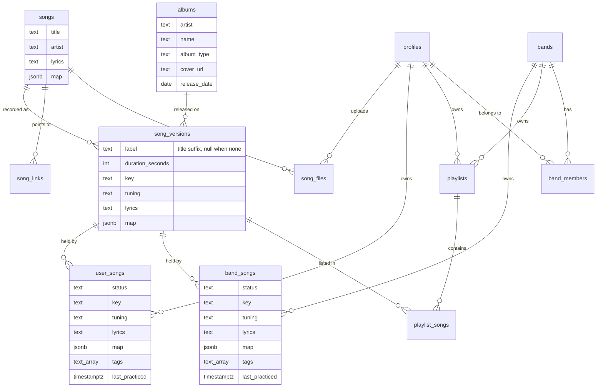

# Repertoire rework — plan

**Date:** 2026-09-24, reconciled 2026-10-01
**Status:** design settled, not scheduled. Deliberately unnumbered — the Meridian
tasks that once held this were created before the model stopped moving, and were
withdrawn.
**Scope:** it began as the song catalog alone and grew with the review. It now holds the
schema and every work item the decisions imply, catalog or not — the band status trigger,
the status control, band context, the Fast View, navigation, offline. The behaviour those
items implement lives in `docs/use-cases.md`; this file says what has to change.
**Reasoning trail and measured evidence:** `docs/reviews/feature-review.md`.
**Interaction mock:** https://claude.ai/artifact/NcCNVR5dHa9ipTJWruvYVH

---

## The model

```sql
albums        (id, artist, name, album_type, cover_url, release_date)
  unique (lower(artist), lower(name))

songs         (id, title, artist, lyrics, map)
  unique (lower(artist), lower(title))

song_versions (id, song_id, album_id, label, duration_seconds,
               key, tuning, lyrics, map)

song_files    (id, user_id, song_id, title, file_url, annotations jsonb)

song_links    (id, song_id, version_id null, provider, url, label,
               position, added_by)
  unique (song_id, url)

user_songs    (id, user_id, version_id, status, key, tuning, lyrics, map,
               tags, last_practiced)
  unique (user_id, version_id)
band_songs    (id, band_id, version_id, status, key, tuning, lyrics, map,
               tags, last_practiced)
  unique (band_id, version_id)

playlists     (id, user_id null, band_id null, name, description, cover_url)
  check (user_id is null) <> (band_id is null)

playlist_songs (id, playlist_id, version_id, position)
  unique (playlist_id, position) deferrable initially immediate
  unique (playlist_id, version_id)

catalog_suggestions (id, target_table, target_id, column, value,
                     requested_by, status, reviewed_by, created_at)
```

`catalog_suggestions` replaces `global_song_edits`. One row per proposed field, not a
jsonb of several: the queue groups by target column (`docs/use-cases.md`, *Suggest a
correction to the catalog*), and a multi-field row would belong to several groups at
once. `target_table` and `column` are both interpolated as SQL identifiers on approval,
so both need a closed per-table allowlist — the property `parseGlobalSongEditPayload`
holds today for one table, which has to survive reaching four.

The two uniques on the repertoire tables are what refuse a version already held, and the
two on `playlist_songs` are what keep a setlist ordered and free of exact repeats. The
`version_id` unique is looser than today's per-song one: the studio take and the live take
of the same song can both sit in one setlist.



Not present, each rejected on evidence: `isrc`, `mbid`, `work_mbid`,
`spotify_track_id`, `contributor_id`, `capo`, `is_default`.

### Inheritance

| Field | Levels |
|---|---|
| `lyrics` | `songs` → `song_versions` → repertoire row |
| `map` | `songs` → `song_versions` → repertoire row |
| `key`, `tuning` | `song_versions` → repertoire row |

`lyrics` and `map` behave identically, on purpose. An earlier draft gave `map` only two
levels on the theory that words belong to the composition while arrangement belongs to
the recording. That was too clever: a song does have a recognisable structure that most
versions keep, and what a live take does — stretching the solo — is exactly what the
version override is for. Two fields that are supposed to work "like lyrics" but cascade
over different depths is a wart someone has to special-case when implementing the
resolution. `key` and `tuning` genuinely start at the version. `user_songs` and
`band_songs` are two independent cascades against the version — a band playing in Bb
does not change what you practise alone in C.

### Rules

- **Song identity** is `(lower(primary artist), lower(split title))`. Album is not in
  the key. Primary artist means `artists[0]`, not the joined list: Spotify returns
  "Michael Jackson" on one track and "Michael Jackson, Akon" on another, and joining
  makes those two different artists.
- **Version identity** is `(song_id, album_id, label)`, with `NULLS NOT DISTINCT` —
  Postgres treats nulls as distinct otherwise, and a null label is the common case, so
  two unlabelled versions of one album would both insert.

  `(song_id, album_id)` alone is simpler and nearly always equivalent. It breaks on an
  album carrying two recordings of a song — a deluxe edition with the track and its
  acoustic, a compilation with the radio edit beside the album version — which it
  collapses into one row, losing a real recording with no delete path to undo it.
  Including the label errs the other way: a spelling difference between sources shows one
  extra row in an expanded card, which costs nothing.
- **The title splits, it does not get stripped.** `sanitizeSongTitle` today removes
  remaster, deluxe, anniversary and expanded while deliberately *preserving* live,
  acoustic, unplugged and demo. That served a model where the title distinguished
  versions. Under the grouped card it is wrong: preserving "Live at Wembley" makes the
  live take its own card, which is the split the card exists to prevent.

  The replacement splits on Spotify's " - " suffix convention and keeps both halves. The
  left half is the title and feeds song identity; the right half is the `label` and feeds
  version identity. One parse, both keys, no vocabulary of special words to maintain. A
  title genuinely containing " - " is parsed wrongly; that produces an extra card, which
  is the cheap error again.
- **Band status is authored, not derived.** Ensemble readiness is not the minimum of
  individual readiness: each player can know their part and the group still fall
  apart, or the band can carry a song nobody has alone. The
  `sync_band_repertoire_on_member_update` trigger is deleted and the band status
  becomes editable where the dashboard renders it read-only today.
- **The representative version is a sort, never a column.** A card has to show one
  version, so search orders its candidates by `album_type = 'album'` first, then
  earliest `release_date`, and takes the first. That is computed at search time over
  everything in hand — catalog rows plus the Spotify response, or catalog only, since
  `searchSpotify` returns `[]` on any network or API error and Spotify is optional.

  An earlier draft stored this as `song_versions.is_default`. It was dropped because
  **nothing reads it.** Outside search, no screen ever asks which version represents a
  song: every repertoire row points at a specific `version_id`, so the list, Fast View
  and the offline snapshot all resolve through that. A column written on every insert
  and read by nobody is the exact defect that `contributor_id` has, which this plan
  deletes. Dropping it also removes the recompute-on-insert step, the partial unique
  index, and the ordered pair of UPDATEs that index would have forced inside the
  transaction.

  Computing live also fixes a cold-start flaw the stored flag had: if the only Alien
  Ant Farm version anyone has added is the 2023 re-recording, a stored flag points at
  it while the Spotify rows in the very same response already carry the 2001 album.
- **`albums` is normalised** because the relation is many-to-one and this is a wiki
  catalog with a moderation queue: correcting a cover must touch one row. The
  repertoire override is *not* split out, because that relation is one-to-one and
  splitting it buys nothing but a mandatory JOIN.

### Interaction

- Search merges catalog and Spotify results, groups by `(artist, title)`, ranks by
  title similarity, and **never filters** — a strict filter destroys the typo
  tolerance that is the reason to query Spotify at all.
- Collapsed, the card shows one version and its `[+]` adds exactly that version.
- Expanded, the card's `[+]` disappears and the list takes over, with no version
  marked above the others and no `album_type` filtering.

---

## Work items

Ordered by the damage they prevent, not by size.

### Unify the two song deduplication rules
*Critical. Independent of the restructure — worth doing first, on the current schema.*

Two divergent rules reach the same catalog by two UI paths. `createAndAddSong` matches
on `LOWER(title)` plus `LOWER(album)` when an album was given, **with no artist**, so
two different songs sharing a title and carrying no album collapse into one row and
the second musician silently inherits the first's artist, key, cover and links.
`findOrCreateGlobalSong` matches on sanitized `LOWER(title)` AND `LOWER(artist)`,
ignoring album. Adopt the second shape everywhere.

Nothing can undo an existing false merge: there is no delete path for a catalog row,
and the moderation queue edits a row rather than splitting one.

`createAndAddSong` also runs its lookup, duplicate check and two inserts as four
separate statements **with no transaction**, unlike `updateSong` and
`reviewGlobalSongEdit`. Two musicians adding the same new song concurrently race on
the lookup, so fixing the matching rule alone leaves the duplicate reachable.

### Drop the band status trigger
*High. Independent of the restructure.*

`sync_band_repertoire_on_member_update` recomputes a band's status as `MIN` across its
members on every personal status change, and `RepertoireDashboard` renders the band badge
inert to match. Status is per-owner and nothing aggregates, so the trigger and its
function go, and the band badge becomes the same control as the personal one, gated on
band admin.

RH-83 seeds a newly created personal row with the band's current status instead of
`unknown`, specifically because `unknown` is the enum's floor and the `MIN` would drag
the band's displayed status down when a row appeared as a side effect of writing a note
or uploading a tab. With no `MIN`, that workaround has no reason to exist: personal rows
go back to being born `unknown`, as every other path creates them. Remove it with the
trigger rather than leaving it behind as unexplained behaviour.

Existing band rows keep whatever the trigger last wrote. That is a starting value, not a
migration problem — the first admin to touch it authors it.

The landing page sells the rule being deleted: `f3Desc` promises readiness "calculada
automaticamente pela regra do menor nível" (`src/i18n/dictionaries/pt-BR.json:47`, and
its `en.json` twin). Both have to be rewritten in the same change or the app advertises a
mechanism it no longer has. The replacement is the honest version of what a band gets
instead — a repertoire with its own key, lyrics and readiness, authored rather than
derived.

### Replace the cycling status badge with the note control
*Medium.*

`nextStatus` wraps with `(idx + 1) % STATUS_ORDER.length`, so one tap on a mastered song's
badge sets it to `unknown` — no confirmation, no undo, under a label reading "Click to
advance". Clamping at `mastered` would fix the data loss and leave the badge unable to
correct anything.

The control specified in `docs/use-cases.md`, *Set a song's status*, removes the problem
instead of containing it: four quarter notes, each tappable to that level in either
direction, with the stage name in a fixed-width slot beside them. There is no cycle to
wrap. `nextStatus` has no caller afterwards.

`unknown` becomes zero notes filled, which is also what it should be in
`PlaylistSummary` — the unfilled remainder of the bar rather than a fifth colour beside
four stages.

The control replaces `StatusDropdown` on the Fast View as well, sized to that page's
larger slot, so the dashboard and the Fast View stop disagreeing about whether status can
move backwards (F2.5). `STATUS_CONFIG` keeps its labels and colours; `STATUS_ORDER`
becomes the four real stages with `unknown` outside it.

### Fall back to personal context when the selected band is gone
*Medium. Independent of the restructure.*

`AppShell` reconciles the persisted band context against the bands the server returns,
but only on the branch where the band **is** found — it refreshes the stored name and
colour. There is no other branch. A context pointing at a band the user has left, been
removed from, or that was deleted simply stays.

Every band-scoped read and write then goes through `resolveOwner` into
`assertBandMember` and throws "Access denied: not a member of this band". The context
lives in `localStorage`, so reloading returns to the same state; the only way out is
knowing to change context in the switcher. The fix is the missing `else`: a persisted
band absent from the list reverts to personal.

Signing out is already handled — `signOutAndPurge` clears the context before
`authClient.signOut()`, so a second account on the same browser does not inherit the
first one's band.

Not investigated: the Fast View also takes context from the URL as `?bandId=`, so a
bookmark or a shared link carries it independently of the store. Which one wins when they
disagree, and what a stale link does, is unknown.

### Stop the Fast View dropping songs silently
*High. Folded into "Address the Fast View by version and navigate a queue" below — kept
here because it is the symptom that found the cause.*

`getPlaylistWithSongs` builds the playlist page with `JOIN global_songs` and never reads the
repertoire. `getPlaylistDetailsWithEntries`, which feeds the Fast View, uses an inner
`JOIN repertoire`. So a song removed from the repertoire stays on the playlist page and
disappears from the Fast View — on stage, mid-setlist, with no message. Under band context
the join is on `r.band_id`, so it is enough for the song to be missing from the *band's*
repertoire while the member still holds it.

Worse than it first looks: `computePlaylistNav` returns `null` when the current song is not
in the list, and `null` makes every setlist component render nothing. Losing one song loses
the whole navigation.

Not fixable alone. The `LEFT JOIN` needs an id to point at, and the page is addressed by
repertoire row — which is exactly what the queue item changes.

### Stop discarding song edits silently
*High.*

`updateSong` writes every catalog field as `CASE WHEN <empty> THEN $n ELSE <current> END`.
A musician who corrects a misspelled artist sees the form report success and the value
snap back, with no indication which fields were ignored. `links` has the same guard and
counts as empty only when exactly `[]`, so once a song carries one link nobody can add
a second through this path. The in-code comment still says the correction mechanism is
"not yet built"; `CorrectionModal` is that mechanism, so the comment is stale and the
form never routes a refused edit into it.

Either mark the shared fields read-only and offer the correction path in place, or
report what was dropped.

### Restructure the catalog
*High. The schema above.*

`global_songs` becomes `songs` — "global" only means something in opposition to a local
table, and the table it opposes is called `repertoire`, so the prefix names a contrast
that does not exist. The rename carries `GlobalSong`, `searchGlobalSongs`,
`global_song_edits` and the action names with it.

Then: add `albums` and `song_versions`; split `repertoire` into `user_songs` and
`band_songs`; drop `contributor_id`, which is written on insert, projected into every
payload including the offline snapshot, and read by no screen or logic, on a table
whose own comment states it implies no ownership; add `songs.lyrics` as the shared
wiki lyric, with the per-owner column becoming the override.

The tables keep the `_songs` suffix rather than reviving the word *repertoire*: the
names then read as what they are, and the relationship is legible from the schema alone.

Two constraints in the schema above are easy to lose in the rename and are load-bearing.
`albums` carries an `artist`, keyed `(lower(artist), lower(name))`: finding an album by name
alone merges Queen's *Greatest Hits* with Michael Jackson's into one row, one cover, one
date, irreversibly. And `song_versions`' unique needs `NULLS NOT DISTINCT`, because a null
`label` is the common case and Postgres would otherwise admit two unlabelled versions of one
album. Both are spelled out under **Rules**.

A single `owners` supertype — `owners(id, kind)` with `profiles.id` and `bands.id` as
FKs into it — was considered and set aside. It is the only shape that truly removes the
`isBand ? 'band_id = $2' : 'user_id = $2'` branching, rather than moving it to a table
name, and it would bring referential integrity the CHECK cannot. But it is schema-wide
surgery touching profiles, bands and every owner-scoped read path, so it is a decision
of its own and not part of the catalog work.

**Playlists are settled and in the schema above.** `playlist_songs` points at
`song_versions`, not at a repertoire row: the playlist already names its owner, so the
pair resolves the repertoire entry on its own, and storing the owner twice would let the
two disagree. `docs/use-cases.md`, *Resolving a value*, has the lookup.

One rule that falls out of the owner split: a write reaches exactly one owner. Adding to
a band's repertoire or a band's playlist creates a `band_songs` row and nothing else —
no member's `user_songs` row — and the reverse likewise. Today's Spotify import writes
both; that goes.

Migration cost is explicitly not a constraint — re-registering data is acceptable.

### Split the title instead of stripping it
*High. Part of the restructure — the identity key depends on it.*

`sanitizeSongTitle` removes remaster, deluxe, anniversary and expanded while deliberately
*preserving* live, acoustic, unplugged and demo. That served a model where the title
distinguished versions. Under the grouped card it is wrong: a preserved "Live at Wembley"
makes the live take its own card, which is the split the card exists to prevent.

Replace it with a split on Spotify's `" - "` suffix convention. The left half is the title
and feeds song identity; the right half is `song_versions.label` and feeds version
identity. One parse, both keys, and no vocabulary of special words to maintain.

The label then has to be a field of its own everywhere — a subtitle in a version row, its
own input in manual entry — so that no title ever carries a suffix again. That is what
keeps a title correction from also having to move text into a label
(`docs/use-cases.md`, *Suggest a correction to the catalog*).

Rows already holding a suffix inside the title are a one-off cleanup.

### Replace `global_song_edits` with `catalog_suggestions`
*High. Follows the restructure — the queue has to reach the new tables.*

The queue targets `global_songs` by `song_id`, and its `proposed_data` jsonb is validated
against a closed list of that one table's columns. That list is what makes interpolating a
column name into the approval `UPDATE` safe, since Postgres cannot parameterise an
identifier.

Four shared tables need correcting now — `songs`, `albums`, `song_versions`,
`song_links` — and an album's cover is not a correction "about a song". So the row becomes
`(target_table, target_id, column, value)`: **one row per proposed field**, which is also
what lets the queue group by target column. `target_table` is interpolated too, so it needs
the same closed allowlist the columns do, per table.

Behaviour — two-level grouping, author-only visibility of a pending value, the offer to
keep a refused value as a personal override — is in `docs/use-cases.md`, *Suggest a
correction to the catalog*.

### Process uploaded images on the way in
*Medium. Required by accepting photographs at all.*

Files stop being PDF-only (`docs/use-cases.md`, *Attach a file to a song*), and a photograph
cannot be stored as it arrives. On upload: rotate the pixels upright, strip the metadata,
downscale.

Rotating rather than honouring the EXIF flag is the load-bearing part. Strokes are
normalised against the page as rendered, so they carry no evidence of what they were drawn
over — a future renderer that reads the flag differently invalidates every annotation
already saved, unrepairably. Baking leaves no flag to disagree about. Stripping metadata
also removes the GPS coordinates a phone photo carries, which would otherwise be published
at a public file URL; that reason stands on its own.

This changes the nature of the upload step: today it validates and forwards, and it becomes
a decode-and-re-encode.

### Rebuild the add-song flow
*Medium. Follows the mock.*

Today the floating `+` opens `SongForm`, a flat stack of ten fields — the rare path —
while the common path is a small button under a divider. A live search for
"smooth criminal" returns 20 rows of which 5 are not the song, 10 are Michael Jackson
in different packaging and 3 are Alien Ant Farm.

Build the grouped card list, the collapsed/expanded behaviour above, and the default
version rule. A version row shows the title suffix when there is one and the album
when there is not, with album, year and duration beneath — the year is
`album.release_date`, the album's and not the recording's, so it is provenance and
never a performance date. Duration earns its place: 1:59 against 4:17 says the
Immortal Version is a fragment.

Nothing found opens the manual form, reduced to title, artist, album and status, with
key, duration, cover and links behind a disclosure. Split `SongForm` into a
shared-catalog section and a my-repertoire section; the undifferentiated single column
is what makes the fill-empty-only behaviour invisible.

### Model song links as one table with a provider
*Medium.*

`songs.links` is a jsonb array of `{label, url}`: no provider, no ordering, no
attribution, and replaceable only as a whole. Replace with `song_links`
(`song_id`, `version_id` null, `provider`, `url`, `label` null, `position`,
`added_by`, `metadata` jsonb), unique on `(song_id, url)`. A null `version_id` means
the link applies to the whole song — a Songsterr tab — while a set one ties it to one
recording, as a Spotify URL does.

`provider` is data, not schema: a new platform is a row, not a migration. A small
`link_providers` lookup carries slug, display label, icon and `kind`
(music / video / tab), because the UI needs a label and an icon per provider anyway
and groups by kind. Per-provider tables were considered and rejected: every platform
would cost a table, a migration and a branch in every read path, and reads that want
all links for a song — Fast View and the offline snapshot both do — would become a
growing UNION. Per-provider columns are covered by `metadata`.

Note `spotifyPlaylistSync.ts:103` deduplicates links by exact URL string equality today.

### Tell the requester what happened to a correction
*Medium.*

`global_song_edits.rejection_reason` is written by the admin in `PendingEditCard` and
read back nowhere; no screen outside `/admin/moderation` reads the table at all. A
musician who submits a correction never learns whether it was approved, rejected, or
why. A queue with no reply loop trains people to stop using it.

### Merge the two search result sets into one
*High. Part of rebuilding the add flow.*

`RepertoireDashboard` holds `catalogResults` and `spotifyResults` in separate state and
renders them as separate lists. Nothing merges or dedupes them, so a song already in the
catalog appears twice — once per source — with no indication which row to press. The
grouped card in `docs/use-cases.md`, *Search for a song*, is impossible until they are
one list.

`LIMIT 20` moves with it. It currently caps versions while the grouping is by song, so
twenty rows can be twenty versions of three songs, and songs that exist vanish because
the cut happened before the grouping. Limit songs.

### Address the Fast View by version and navigate a queue
*High. Supersedes the `LEFT JOIN` item above — do them together.*

Three independent reasons converge on one change. The Fast View is addressed by repertoire
row (`/songs/<repertoireId>/fast-view`), and a repertoire row can be absent: a playlist
entry whose owner never added the song, a song removed mid-setlist. So the page has no URL
for a song it must still be able to show.

The address becomes the version, with the owner coming from context. Then:

- the inner `JOIN repertoire` becomes a `LEFT JOIN` and an entry with no row renders at
  version defaults
- `computePlaylistNav` stops returning `null` when the current song is missing from the
  list, which today makes the entire setlist chrome vanish mid-performance
- a computed queue becomes expressible at all

Navigation moves off `?returnTo=<playlistId>`, which can only ever name a playlist, onto a
**queue** in `sessionStorage`: ordered version ids with title and artist, the owner context,
and the origin to go back to. `PlaylistEntrySummary` is already that projection; what
changes is that it serves any source, not only a playlist.

Content is fetched per song in a **window** — current plus neighbours in one request — so a
swipe finds its content in hand and a bad connection pays one latency, not three. Writing a
song invalidates its cached copy. Details in `docs/use-cases.md`, *Walk a queue of songs*.

### Build the practice session
*Medium. New feature. Depends on the queue above.*

A button on the band screen, and its personal equivalent, offers one playlist, the whole
repertoire, or a hand-picked selection; opens the Fast View on that queue; and finishes
through a list of what was played.

Order is `days since last practised ÷ the interval for its level`, highest first —
unassessed always due, learning 1 day, practicing 3, polishing 14, mastered 21. Scaling the
gap by the level is what avoids inventing weights between two signals. Exact ties shuffle;
near-ties do not. The specification, including why, is `docs/use-cases.md`, *Start a
practice session*.

Nothing new is written: every write is the practice case already specified.

### Make `last_practiced` writable, with the review list
*Medium. Nothing writes it today.*

Three triggers, deliberately different: a free field in the edit panel that assigns any
date in either direction, a per-song button that sets today and then asks for the level, and
a playlist-wide button that opens the list of its songs with a tick-all/untick-all control,
writing nothing until confirmed. Rows start unticked.

`docs/use-cases.md`, *Record that a song was practiced*, has the reasoning — in particular
why the field assigns while the buttons only move forward, and why the list does not
pre-tick.

### Make reordering a playlist possible
*Medium.*

`uq_playlist_song_position` becomes `DEFERRABLE INITIALLY IMMEDIATE`, and a reorder is one
`UPDATE ... FROM (VALUES ...)` rewriting every position. Measured on Postgres 16: a plain
unique rejects that statement, and rejects `pos = pos + 1` too, because it checks row by row
and a permutation is briefly invalid midway; declaring it deferrable moves the check to the
end of the statement and the permutation succeeds. It still rejects a genuinely duplicate
final state, and it still serialises two concurrent inserts at the same position — the
reason the constraint exists.

The one thing lost is `ON CONFLICT (playlist_id, position)`, which Postgres refuses against
a deferrable constraint. Nothing uses it. `unique (playlist_id, version_id)` stays
immediate, keeping `ON CONFLICT DO NOTHING` available to a bulk import.

### Build the admin catalog screen: merge, split and delete
*Medium. Follows the restructure.*

Removing a `songs` or `song_versions` row is not a user action. It cascades into
`user_songs`, `band_songs`, `playlist_songs` and `song_files` belonging to people who never
asked and get no warning.

And the operation that actually arises is not deletion. A false merge from the dedup bug
needs **splitting**; a duplicate version needs its siblings **repointed** at one row. Both
are merges, carrying the repertoire and playlist rows across so nobody loses anything.
`DELETE` is the degenerate case of a merge whose reference count is zero.

The admin needs the blast radius before confirming: how many repertoires and how many
playlists the row sustains.

### Build the song map editor
*Low. Follows the restructure.*

The `map` column lands with the restructure — jsonb, read whole, written whole, never
queried by part, cascading exactly like lyrics so there is no second override mechanism.
This is the screen that edits it.

### Download individual songs for offline, not only playlists
*Low.*

Offline capture is per playlist. One song you are about to perform is a legitimate smaller
unit, and the snapshot shape already carries songs rather than a playlist blob.

The same work corrects what comes down: `repertoire_tabs` hangs off a `repertoire` row, so a
band playlist's snapshot takes the *band row's* tabs and skips the member's own. Under the
new model only the reader's files exist, so the reader's files are what must be captured.

### Make catalog search use an index and rank its results
*Medium.*

`searchGlobalSongs` runs `ILIKE` with a leading wildcard over title and artist, which
no btree can serve, so `idx_global_songs_title` and `idx_global_songs_artist` are dead
weight and every search is a sequential scan. `ORDER BY title` also ranks an exact
match below any alphabetically earlier substring match. `pg_trgm` with a GIN index and
a similarity ordering is the standard fix and needs one migration. Revisit the
unpaginated cap of 20 at the same time.

### Disable every write control while offline
*Medium. **Done — RH-99.***

Offline is read-only by intent (`docs/use-cases.md`, *Read offline*), and most of the Fast
View honoured it already: the page derives `readOnly` from one offline signal and the edit
controls take it. Adding a link did not. `useSongLinks.submit` discarded `updateLinks`'s
return value, and `offlineFirst` classifies that method as an envelope write — so offline
it *resolved* `success: false` instead of rejecting. The `await` saw success, the link was
pushed into the on-screen list and the toast read "Link added successfully!". Nothing was
saved.

`confirmDelete`, twenty lines below in the same hook, at least read the same return
value, which is why this was an oversight rather than a decision — though it branches
on `result.pending` alone, so a `{ success: false }` envelope is still announced as
`Link deleted.` there. RH-130 owns that remainder.

RH-99 closed it by disabling the controls, and audited every write surface reachable with
no network against the same rule. Now disabled: the link add trigger, the per-link
deletes and the add form's submit; the tab upload form (title, file, submit) and the
per-tab deletes; PDF Stage Mode's `Toggle drawing`, so drawing is never enterable and no
annotation save is attempted; the lyrics editor's `Save`, `Discard my version` and web
import; and `Available offline` / `Refresh offline copy` on `/playlists/[id]`. `submit`
reads its envelope too, as a safety net rather than the fix. Deliberately untouched: the
reads, and the purely local writes that complete offline (`Remove offline copy`, clearing
offline storage).

The signal is threaded as a prop from one reader per route — the Fast View page and
`PlaylistDetailView` — so no component reads `navigator.onLine`. The pages the service
worker never serves offline are still out of scope: they need an app-wide read-only
mechanism, which is its own task.

### Delete `/songs/search`
*Low.*

`src/app/songs/search/page.tsx` is eight lines rendering "Global song search coming soon",
and `src/proxy.ts` authenticates and protects it regardless — a signed-in dead end. It was
scaffolded and never built, so it goes, along with its proxy matcher entry. The search that
works is the dashboard box, which is specified in `docs/use-cases.md`, *Search for a song*.

### Add `updated_at` to the catalog
*Low.*

`global_songs` is alone among the mutable tables in carrying only `created_at`. Without
`updated_at` the offline snapshot has nothing to compare a cached row against, so
staleness detection — deliberately deferred in the RH-28 design — has no column to
build on when it is picked up.

---

## Held until the rework is used

Both are tasks on the board at `blocked`, with the reason recorded there. Nothing unblocks
them automatically: they wait for the rework to be implemented and lived with, because each
asks a question that only experience answers.

### Mark who was present at a rehearsal — `RH-119`

It would let one tap credit several musicians truthfully, and it is the only thing that
brings `GREATEST(existing, new)` back. That rule was specified in this document and is
withdrawn: it existed to stop a band rehearsal from erasing a member's more recent solo
session, and with nothing propagating there is nothing to erase.

Note that this is no longer what "rehearsal mode" means — that became the practice session,
which is a work item above and writes nothing new.

### Store every album a recording appears on — `RH-120`

One recording is released many times: the 1987 studio take of *Smooth Criminal* sits on
*Bad*, on *Number Ones*, on *The Essential Michael Jackson*. `song_versions.album_id` holds
**one** album, so the model keeps a representative and drops the rest. A join table —
`version_albums` — would keep them all.

The consequence follows from version identity including the album: the same recording on two
albums becomes **two version rows**. That is erring by splitting, and a spare row in an
expanded card is the cheap error — a wrong merge has no delete path. Whether the split is
actually annoying can only be judged against real catalog data.
