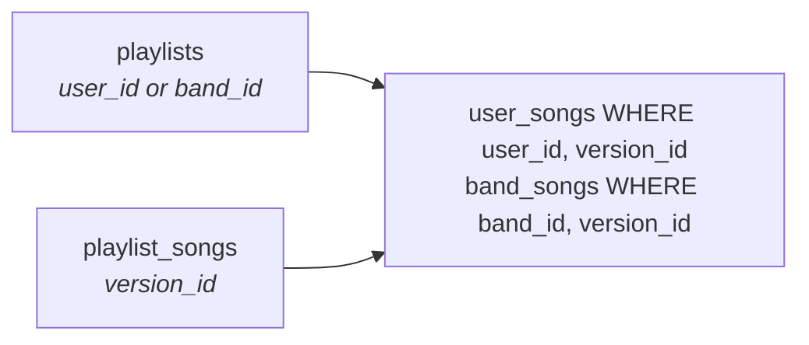
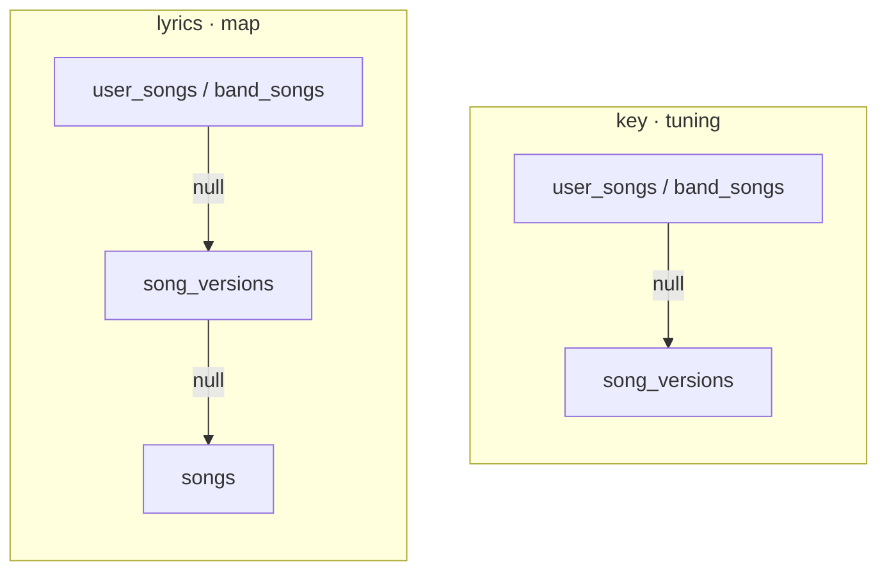

# Use cases

What happens when someone does something. One section per case.

A use case survives a schema change: "adding a song to a playlist also puts it in the
repertoire" stays true whatever the tables end up called. So these name tables, they
never define them — the DDL lives in `docs/plans/repertoire-rework.md`, and what exists
in the codebase today is audited in `docs/reviews/feature-review.md`.

Every table named here is the **target** model. The current schema is superseded and is
not a constraint on any decision below: `global_songs`, `repertoire`, `personal_key` and
`repertoire_tabs` are gone, replaced by `songs`, `song_versions`, `albums`,
`user_songs`/`band_songs` and `song_files`. Where a case needs to say what the code does
today, it says so and names the file.

Each case carries **Decided** and **Open**. A decision taken in conversation and left
there becomes a question again an hour later; this is where it stops being one.

---

## Resolving a value

Two things every screen does before it can show a song: find the owner's row, then
walk up until a field is non-null.

### Finding the owner's row



The owner comes from the playlist, the version from the playlist entry. Together they
are the unique key of the repertoire table — one index hit. The same version opened
from a personal playlist and from a band playlist resolves to two different rows, with
different key, tuning, lyrics and map. That is the whole reason `playlist_songs` stores
a version and not a repertoire row: the owner is already known, and storing it twice
would let the two disagree.

### Walking up



Different depths, on purpose. Words and structure belong to the composition, so they
start at `songs`; a live take overrides them because it has ad-libs and a longer solo.
Key and tuning are properties of a recording and have nothing to inherit above it.

A missing repertoire row is not an error: it resolves exactly like a row whose
overrides are all null. Only `status` has no fallback, and "not in my repertoire yet"
is legitimate information.

---

## Writing a band's rows

Every write to a band's repertoire requires band admin. Adding, removing, status, key,
tuning, lyrics, map, tags — all of them. A member who is not an admin reads the band's
repertoire and cannot change it.

This is a deliberate simplification, not a considered permission model. A finer split —
say, adding open to members and removing reserved to admins — is plausible and can come
later; starting permissive and tightening is the harder direction, so it starts closed.

`assertBandAdmin` already exists but is private to `src/lib/bands.ts`. Applying this rule
is exporting it and routing the band branch of every repertoire write through it, in
place of `assertBandMember`.

One interaction worth naming: the practice button writes two rows, the presser's own and
the band's. Under this rule a non-admin tapping it in a band playlist records their own
practice and leaves the band's date untouched — the band's only advances when an admin
taps. Correct under the rule, and a reason the rule may not survive contact with a real
rehearsal.

---

## What creates a personal row in band context

Reading a band's song and acting on it usually writes the band's row. Three actions
write yours instead, and they share a reason: **what is yours by nature lands on you.**

- **Uploading a file.** `song_files` has a `user_id` and no `band_id`, so a band holds
  none. There is nowhere else for it to go.
- **Editing the lyrics and choosing your own version.** Lyrics exist at both levels and
  the editor asks which one it is writing — the only override that asks, because it is
  the only one long enough to be worth comparing before deciding.
- **Tapping "practised it".** You rehearsed, not the group. The band's own date is a
  separate write, and an admin's.

Everything else — status, key, tuning, map, tags, and the lyrics when you pick the
band's version — exists at both levels and writes the band's row. Your repertoire is
untouched and the song does not appear in it.

This does not bend the one-owner rule. Each of the three has exactly one owner and it is
the musician; the row that appears is theirs, born `unknown` like any other.

---

## Add a song to the repertoire

**Trigger** — the `[+]` on a search card, the `[+]` on a row of the version list, or the
manual form, which is always available and not a consolation for an empty search. Original
material is the reason: a song the band wrote is not on Spotify and never will be, and
reaching its entry form through a search that fails first is the wrong shape for the most
personal thing in the app.

**Steps** — one transaction:

1. `songs` — find by `(lower(artist), lower(sanitized title))`; create if absent
2. `albums` — find by name; create if absent
3. `song_versions` — find; create if absent
4. `user_songs` or `band_songs` — insert, status `unknown`

Steps 1–3 normally find rather than create. That is the shared catalog working: a song
someone else already entered arrives with its album, cover and links filled in. Only
step 4 is yours.

Adding a version already in that repertoire is refused, not duplicated: the unique on
`(owner, version_id)` is what says so.

**Decided**
- Entries are born `unknown`, always. A song the band already plays at "mastered" still
  starts unassessed in your own repertoire — the band knowing it says nothing about you.
- The card adds the version it displays — what is shown is what is added.
- Which repertoire table receives the row follows the context, band or personal — and
  only one row is written. Adding to a band's repertoire does not reach any member's,
  and adding to yours does not reach the band's. A member who wants the song personally
  adds it themselves. A "add to mine too" shortcut is possible later, as an explicit
  action rather than a side effect.

---

## Add a song to a playlist

**Trigger** — adding from inside a playlist, or importing a Spotify playlist whole.

**Steps** — the four above, then one more:

5. `playlist_songs` — insert with the playlist and the version

The playlist already exists; this adds an entry to it. Which repertoire table step 4
writes to is decided by the playlist's owner: `playlists.user_id` means `user_songs`,
`playlists.band_id` means `band_songs`. The CHECK guarantees exactly one is set, so
there is no ambiguous case.

**Decided**
- A song entering a playlist enters the repertoire. A playlist entry therefore always
  has a row to resolve overrides and status against.
- `playlist_songs` stores `version_id`, not a repertoire row id — see *Finding the
  owner's row* above.

- Adding to a band playlist writes the band's repertoire row only, never a member's.
  Today's import does both; that behaviour goes.

- `unique (playlist_id, version_id)` lets the studio and the live recording of one song
  sit in the same setlist. Accepted: a set that plays both is a real set.

---

## Remove a song from a playlist

**Trigger** — the remove control on a playlist entry.

**Steps** — delete the `playlist_songs` row. Nothing else.

The repertoire row stays, with every override intact. A playlist is a set, and removing
from a set removes from the set.

Deleting a whole playlist is the same rule applied at once: the entries go, every
repertoire row stands. Nothing is decided there that is not decided here.

**Decided**
- Removing from a playlist never touches the repertoire. The two are independent in
  both directions.
- On a band playlist, only a band admin may remove.

- No `added_by` on `playlist_songs`. It was proposed to fix an asymmetry — members
  adding, admins removing — that does not exist: every band write requires admin, so
  only admins add in the first place.

---

## Remove a song from the repertoire

**Trigger** — the remove control on a repertoire entry, personal or band.

**Steps** — delete the `user_songs` / `band_songs` row, after a confirmation.

The confirmation carries the two things the screen does not show: the overrides about
to be destroyed — key, tuning, lyrics, map, status, practice date — and the playlists
holding that version.

Only the owner's own playlists. A band playlist resolves against `band_songs` and never
reads a member's personal row, so listing one there would be false.

Playlist entries are left alone. An entry whose repertoire row is gone resolves like one
whose overrides are all null (see *Resolving a value*): the song stays in the setlist, at
version defaults.

Files go with the song, and the confirmation lists them by name — losing a tab you
scanned and annotated is worse than losing a transposition.

But `song_files` is keyed by `(user_id, song_id)`, not by version: one tab serves the
studio and the live take alike. So the delete is conditional on this being the **last**
version of that song leaving the repertoire. Removing one of two versions touches no
file and the confirmation does not mention any; removing the last one deletes them and
says which.

Removing from a band repertoire never deletes a file. Files are personal — `song_files`
has a `user_id` and no `band_id` — so the band holds none to lose.

**Decided**
- Deleting the row destroys the overrides, and the last version of a song leaving takes
  that song's files with it. There is no soft state to come back to, and the
  confirmation — overrides, playlists, files by name — is what makes that fair rather
  than surprising.
- A band repertoire holds no files, so removing from one never deletes any.
- `band_songs` is band-admin only. `user_songs` belongs to its owner alone.
- Playlist entries survive, in both directions.
- Removing from the shared catalog is not this case and not a user action at all — see
  *Deleting from the shared catalog* in `docs/plans/repertoire-rework.md`.

- The confirmation is skipped when the row carries no overrides, no files and sits in
  no playlist. Nothing would be lost, so there is nothing to ask about.

---

## Edit or clear an override

**Trigger** — one of three doors.

- **Direct controls on the Fast View** for status (the notes) and `last_practiced` (the
  button). Both are discrete, self-evidently controls, and cheap to undo, so putting them
  behind an edit step would waste the one-tap design.
- **A button beside lyrics and beside map**, each opening its own editor. They are long
  text, and a stray touch on a page read while playing must not overwrite them.
- **An edit panel** for everything else — key, tuning, tags — which also reaches lyrics
  and map. Those two therefore have two doors onto the same write: the section button for
  "change this while I am looking at it", the panel for "edit this song's fields".

**Steps** — update the owner's row, creating it if it does not exist.

Setting a value and clearing one are the same write with different inputs: a value fills
the column, clearing writes null, and null is what sends resolution up the chain again.
So "back to the album version" needs no separate action.

It does force a distinction in the UI, though: *inherited* and *set to the same value as
the parent* look identical and behave differently. The second survives an edit to the
version; the first follows it.

The row may legitimately be absent — a version reached from a playlist whose repertoire
row was never created. The edit creates it, status `unknown`, exactly as adding does.

**Decided**
- Clearing a field is writing null. There is no separate unset.
- The gesture for it is an explicit "use the original", offered beside the value the
  override icon reveals — not emptying the input. Same write, legible intent: clearing a
  forty-line lyric by deleting all of it looks like destruction, and a musician will not
  risk it.
- Resetting a long field — lyrics, map — confirms first, because it discards an
  adaptation that was written by hand. Key and tuning reset immediately; retyping three
  characters is not a loss.
- Which row is edited follows the owner context, exactly as resolution does.
- Editing is never in place. A field on a reading page is not a control, which also
  settles the icon question below: with the field itself not tappable, the override icon
  is the only target in that row.

- An inherited value changing when the catalog is corrected is accepted, not a hazard to
  design around. If the version said G and it is Am, the correction should reach every
  musician who never authored a key of their own — that is the shared catalog working.
  Surfacing inheritance is therefore about orientation, not about warning anyone.

- Inherited values render as ordinary text. What carries a marker is the **overridden**
  field, not the inherited one — an icon beside it. Marking the exception rather than the
  rule keeps the screen quiet, since most fields inherit, and it marks the state the
  musician authored, which is the one worth finding and the only one worth undoing.
  Nothing is encoded in colour alone.

  The icon reveals what it replaced. For a short value — key, tuning, a tag — that fits
  in a tooltip. Lyrics and map do not fit and open a comparison instead; the RH-83
  version switcher is that comparison, built for lyrics before the pattern was named, and
  generalising it is the work.

- In band context, saving lyrics asks where they go — the band's or yours — through
  every door. The question belongs to the write, not to the button that opened it, so
  the panel and the section editor ask the same thing. In personal context there is
  nothing to ask.
- The question comes at **save**, not at open, and the editor starts from the text on
  screen. That order allows the flow that matters: read the band's words, adjust two
  lines to how you sing it, save as your own. Asking first would force the decision
  before knowing what the change is. RH-83 asks at open today; this moves it.

---

## Leave a band

**Trigger** — a member leaves, or an admin removes them.

**Steps** — delete the `band_members` row.

**Decided**
- `band_songs` belongs to the band, not to its members. The band's repertoire does not
  shrink when someone leaves, and nothing in it is rewritten.
- The member keeps their own `user_songs` rows, overrides and files. They simply lose
  access to the band's playlists and repertoire.

Detail belongs to band management, not here.

---

## Attach a file to a song

**Trigger** — the upload control on a song opened from a repertoire or a playlist.

**Steps**

1. store the file, keyed by `(user_id, song_id)` and not by the version or the
   repertoire row
2. insert `song_files` with the title the musician typed
3. create the `user_songs` row if it does not exist, status `unknown`

Step 3 happens even in band context — see *What creates a personal row in band context*.

**Decided**
- The file belongs to the musician and the composition. One tab serves every version of
  that song: opening the live take shows what the studio take shows.
- A band holds no files. `song_files` has a `user_id` and no `band_id`, so every
  attachment is personal even on a song the band plays. Key, tuning, lyrics, map and
  status are the band's to author; a scanned chart is not.
- No `kind`. Tab, chord chart or sheet music is a distinction nothing in the app acts
  on — the title the musician writes carries it.
- Annotations live on the file, per page, as jsonb. They are strokes over a rendered
  page, so they follow the file and not the version.

- Attaching a file puts the song in the repertoire. Bothering to scan a chart is a
  stronger statement of intent than tapping `[+]`, so the repertoire row follows from it
  rather than being a precondition. Same shape as a playlist entry creating one.
- Photographs are accepted, not just PDFs, and open in the stage with the annotation
  layer over them. The stroke math is normalized against a rendered geometry and knows
  nothing about PDF, so an image is a renderer swap behind an interface that already
  exists; an image is page 1 and the page controls disappear.

- An uploaded image is rotated upright on the way in and stored with its metadata
  stripped. Not because the math needs it: `normalizePoint` cancels the native
  dimensions out, so a stored stroke is a plain fraction of the rendered box and is
  correct as long as every renderer agrees about the orientation flag. That agreement is
  the fragile part. A stroke records no evidence of what it was drawn over, so a future
  renderer that reads EXIF differently — a canvas path, a server-side thumbnail, the
  offline view — silently invalidates every annotation already saved, unrepairably.
  Baking the rotation leaves no flag to disagree about.

  It is free: the image is already being re-encoded to downscale it, and rotating is the
  same pass. And stripping metadata removes the GPS coordinates a phone photo carries,
  which would otherwise be published at a public file URL alongside the chart. That
  reason stands on its own.

  A manual rotate control, if it is ever built, re-encodes the file rather than setting a
  display flag — the flag is the thing being eliminated — and transforms existing
  strokes, which in normalized coordinates is `(x, y) → (1 - y, x)` per quarter turn.
- Images are downscaled on upload. A phone photo passes the size a tab PDF never
  approached. Resizing is safe at any point, before or after annotation, because
  normalized coordinates survive it.
- A file attached to a song whose versions differ sharply — an acoustic reworking — is
  the wrong file, with no way to scope it to one version. Deliberate: scoping to the
  version would break the case that made the decision, tabs written in sections that
  ignore arrangement.

---

## Delete a file

**Trigger** — the delete control on a file, or the last version of that song leaving the
repertoire (see *Remove a song from the repertoire*).

**Steps** — delete the `song_files` row, then the stored object.

**Decided**
- That order, deliberately. A failure between the two leaves a stored object nobody
  references — invisible, costing storage. The reverse order leaves a row pointing at
  nothing, which is a broken file in the musician's list. Orphaned storage is cheaper to
  live with and can be swept; a broken link cannot be repaired.
- Deleting a file destroys its annotations with it. They are a column on the row.

- An explicit delete asks for confirmation too. A scanned, annotated chart is not
  reproducible, and aiming at the control is weaker evidence of intent than the cost of
  being wrong.

---

## Record that a song was practiced

**Trigger** — three, and they behave differently on purpose.

**1. The `last_practiced` field in the edit panel.** Assigns whatever date was typed,
forward or backward. Its job is correcting a mistake, and a mistake in a date is usually
a date too far forward, so a rule that only moved it forward would make the worst typo
permanent. It never asks about status: the panel edits status too, so the musician is
already where they would go next.

**2. The button on one song in the playlist view.** Sets today, then asks for the level.
This is the solo case — one song, practised, and the moment right after playing it is the
only moment the musician actually knows how it went. Skipping the level is allowed:
sometimes you played it and cannot say whether it improved.

**3. The button for the whole playlist.** Opens a list of its songs. The musician ticks
the ones actually played and adjusts levels, and nothing is written until they confirm.
This is the rehearsal case: a rehearsal rarely covers a whole setlist, so writing every
song on one tap would be wrong most of the time.

Rows start unticked, above a control that ticks all and unticks all. That makes a
twelve-song setlist one tap — as good as starting ticked — while a sixty-song
"everything we play" list, where eight were rehearsed, starts from the right place
instead of needing fifty-two corrections. Ticking all and then dropping the three that
were skipped stays one tap away, so neither shape of list is the awkward one. It also
removes any accidental-confirm risk, so closing the list needs no special handling.

**Steps** — write `last_practiced` on the owner's row, and `status` where it was set.

**Decided**
- Editing assigns; the buttons set today. Different operations on one column, and
  conflating them makes one of the two useless.
- Nothing propagates to other members. Whoever taps records their own practice and
  nobody else's — the app never credits a musician who was not there. Each member taps
  for themselves.
- On a band playlist the band's own row is written too: that the band played the song is
  a fact about the band, and `band_songs` authors its own values already.
- Assessing the level belongs to the two buttons and not to the panel, because it is the
  act of playing that produces the knowledge.
- No `GREATEST`. It existed to stop a band rehearsal from overwriting a more recent solo
  session, and with no propagation there is nothing to overwrite. It comes back only if
  propagation does.

- Trigger 3's list is also how a practice session ends — see *Start a practice session*.

**Open**
- Marking who is present. It would let one tap credit several musicians truthfully,
  bringing propagation — and `GREATEST` — back with it. Note that this is no longer what
  "rehearsal mode" means: that became the session in *Start a practice session*, which
  deliberately writes nothing new. Presence is a separate idea, deferred and not rejected.

---

## Set a song's status

**Trigger** — the status control on a repertoire entry, in any context that shows one.

**Steps** — write `status` on the owner's row.

**Decided**
- Status is per owner and nothing aggregates. Each musician holds their own, each band
  holds its own, and neither is derived from the other. Everyone individually knowing a
  song does not mean the group plays it well, which is the case the aggregate could
  never express.
- A band's status is authored by a band admin, like any other band value.
- Entries are born `unknown`, and `unknown` means unassessed rather than a stage below
  `learning`. With nothing aggregating, its position in the order only affects sorting
  and filtering.
- Status has no fallback in the cascade. "Not in my repertoire yet" is legitimate
  information, not a value to inherit.

- The control is four quarter notes with the stage name beside them. Tapping a note
  sets that level directly, in either direction; tapping the note that is already
  current drops one, which is how a row returns to unassessed without a separate target.
  Nothing cycles, so nothing wraps past `mastered`.
- Four notes, not five. None filled is `unknown` — no rating is what an empty rating
  control has always meant — and the four filled positions are the four real stages.
  The scale is four stages plus an empty state, which is what it always was.
- `unknown` leaves the playlist progress bar as a coloured segment and becomes the
  unfilled remainder of it, for the same reason.
- The name needs a fixed-width slot beside the notes, or the notes shift horizontally as
  the word changes length.

- The notes replace the Fast View's dropdown too. One control everywhere, which is what
  ends the disagreement between the two screens rather than formalising it.

  It sizes to the space rather than being one size. In a dashboard row the notes share
  their width with cover, title and artist and land around 17px — acceptable sitting
  down, where a mistap costs one more tap. On the Fast View, status has a section of its
  own, so the same four notes get a comfortable target: that page is read standing up,
  with an instrument, often in bad light.

**Open**
- Whether an unfilled note reads well enough on stage. The outlined notehead is thin, and
  two filled versus three is less obvious under stage light than on a desk. The larger
  Fast View size helps; whether it is enough is not something a mockup answers.

---

## Start a practice session

**Trigger** — the button on the band screen, or its personal equivalent.

**Steps**

1. choose the source: one playlist, the whole repertoire, or a hand-picked selection
2. open the Fast View on those songs, ordered by what most needs playing
3. walk them; finish through the playlist-wide practice list (*Record that a song was
   practiced*, trigger 3)

**The order** is `days since last practised ÷ the interval for its level`, highest first.
A ratio above 1 is overdue.

| Level | Interval |
|---|---|
| unassessed | always due |
| learning | 1 day |
| practicing | 3 days |
| polishing | 14 days |
| mastered | 21 days |

Scaling the gap by the level is what avoids inventing weights. Adding the two signals
together would mean deciding, arbitrarily, whether a mastered song untouched for a year
outranks one being learned that was played yesterday. Dividing makes the level say how
urgent the song is and the gap say how much of that urgency has accrued.

What falls out without being designed: a song never practised divides by nothing and goes
top; mastered songs surface rarely; anything being learned returns almost every session.

Read in weekly rehearsals the table is coarser than it looks — learning and practicing
both mean "every time", polishing every second, mastered every third. The finer
distinction between 1 and 3 days only matters for solo practice, which can be daily. The
same numbers serve both rhythms.

**Decided**
- The session writes nothing new. It picks and orders; every write is the practice case
  already specified. Presence, propagation and `GREATEST` stay out.
- Exact ties break at random. They are common rather than rare: a setlist marked in one
  rehearsal, at one level, ties exactly — and without the shuffle it would present in the
  same order every time.
- The numbers are a starting point; the structure is the decision.

- Near-ties are **not** shuffled, only exact ties. The repetition worth avoiding is the
  same ten songs in the same order every session — and those ten were dated in the same
  rehearsal, so they tie exactly and already shuffle. A near-tie is seven days against
  eight at one level: a real difference, one song being a day staler, and shuffling it
  would discard information.

**Open**
- Show mode. Same shape, ordered by the playlist instead — a way to have tabs and lyrics
  queued up to navigate through. It needs decisions of its own and is deferred.

---

## Annotate a file

**Trigger** — opening a file in stage mode from the song screen.

**Steps** — draw over the rendered page; strokes save per page, debounced, into the
file's `annotations`.

**Reading and annotating are two states, and the chrome follows.**

- **Drawing off** — the page and nothing else. One small button, bottom centre, turns
  drawing on. Pages turn by tapping the left or right edge, which is unambiguous here
  because there is nothing to draw on.
- **Drawing on** — the toolbar appears: pen, erase, pan, colours, zoom, page navigation
  and the save indicator, which only means anything once there is something to save.

The reason is vertical space. The toolbar is two stacked rows at a deliberately constant
height, and a phone held sideways has around 390px of it — so the chrome takes better
than a quarter of the page, in the one dimension that is scarce. Landscape is also
exactly how a musician props a tab on a stand.

Keying this to the drawing state rather than to the orientation makes it about intent:
you are reading, or you are annotating. It also costs little, because `drawingEnabled`
already exists and already hides the drawing controls — it just does not hide the bar.

**Decided**
- Strokes are normalized against the rendered page, not stored in pixels, so they survive
  zoom, a different screen and a re-encoded image.
- Annotations belong to the file. A file serves every version of its song, and so do its
  annotations.

**Open**
- Bottom-centre keeps the button clear of the side strips, but tapping an edge and
  swiping to the next song share a region. They are different gestures and should
  coexist; the stage is a full-screen overlay, so setlist swiping may not even be live
  behind it. Worth confirming rather than designing around.

---

## Search for a song

**Trigger** — the search box on the dashboard, or the picker when adding to a playlist.

**Steps**

1. query the catalog and Spotify in parallel, debounced
2. merge both into one list, grouped by `(lower(artist), lower(sanitized title))`
3. each group is one card, showing one representative version
4. expanding a card lists every version it has

**One list, not two.** Today the two sources are held in separate state and rendered
separately, so a song already in the catalog appears twice — once from each — and nothing
says which row to press. Merging is what makes the grouped card possible at all: twenty
Spotify rows and three catalog rows become four cards.

Spotify is optional. `searchSpotify` answers `[]` on any network or API failure, so a
search still returns the catalog alone rather than failing.

**The representative version is computed here and stored nowhere.** Order the group's
candidates by `album_type = 'album'` first, then earliest `release_date`, and take the
first. Computing it live is also what lets a Spotify row in the same response beat a
catalog row: if the only version anyone has added is a 2023 re-recording, the 2001 album
is right there in the response and wins.

**Decided**
- A version row leads with the album: `Bad · 1987 · 4:17`. The label is a subtitle,
  present only when there is one — "Radio Edit", "Live at Wembley".

  This inverts an earlier mock, which led with the label. The common case is one song
  across several albums with **no** label at all — `Bad`, `Bad (Remastered)` 2012, `Bad
  (Remastered)` 2025 — and leading with the label left that case's strongest line blank
  while the album and year, the things that actually distinguish the rows, sat in small
  grey text. A labelled version is the rare one.
- The version list filters nothing. Single, compilation and album all appear; a musician
  looking for the single should not have to type the word. `album_type` only orders which
  one the collapsed card shows.
- The limit counts songs, not versions. Limiting versions first and grouping after drops
  whole songs from the results depending on how many versions the earlier ones happened to
  have.
- Manual entry sits alongside the results, always, not behind an empty one. See *Add a
  song to the repertoire*.

**Open**
- Not a decision but an unverified assumption: collapsing a catalog row and a Spotify row
  for one version compares them by `(album, label)`, and the catalog holds an `album_id`
  while Spotify hands back the album's **name** as text. The comparison is therefore
  name-based, and names vary in spelling — "Bad" against "Bad (Remastered)". When they
  differ the two rows do not collapse and the same version appears twice in an expanded
  card. Only real data settles how often that happens.

---

## Suggest a correction to the catalog

**Trigger** — proposing a change to any shared value: `songs`, `albums`, `song_versions`
or `song_links`. Everything global goes through review; nothing global is written
directly.

**Steps**

1. one "suggest corrections" button on the song screen opens a form holding every shared
   value visible there, grouped by where it lives: the song, the album, this version, the
   links
2. saving writes **one row per changed field** — one action for the musician, several
   independent suggestions in the queue
3. each displays to its author, and to nobody else
4. an admin approves each — it becomes the official value and the mark clears — or
   rejects it

One row per field is what makes column-level grouping possible at all: a suggestion
carrying three fields would belong to three groups at once. It also narrows the payload
to a column and a value, which is what a closed per-table column list has to validate.

**A pending suggestion is a rung of the cascade**, visible only to whoever made it:

```
personal override  →  your pending suggestion  →  official value  →  …
```

So a field shows one of three states, and the mark beside it has to tell them apart:
official, overridden, suggested. Their futures differ — an override is permanent, a
suggestion either becomes everyone's or disappears.

**Suggesting and overriding are different acts on the same field.** "This recording is
in Am, not G" is a claim about the world. "I play it in C" is a fact about you. Both can
be true at once, which is why a suggestion does not imply an override and why an existing
override keeps displaying over your own pending suggestion.

**On rejection.** If the field has a personal override and the author has none, offer to
keep the rejected value as one — it is the only thing of theirs on that field, and
discarding it silently would waste the work. Only four fields can take one: key, tuning,
lyrics and map. Title, artist, every album field, label, duration and links have no
personal level, so rejection there is a notice and nothing more.

**Decided**
- Nothing shared is visible to others before approval. That removes the improper-link
  worry without a rule about which fields are safe: an unapproved URL reaches exactly one
  person, the one who typed it.
- Suggestions group on two levels. The outer one is the **target** — table, row and
  column — so every competing correction to one field is reviewed together. The inner one
  is the **value**: identical proposals collapse to a single option carrying its count and
  its requesters.

  Choosing an option approves it and closes the others in the same act. That is what
  removes the stale approval structurally rather than detecting it: there is no Monday
  proposal left pending to be approved on Wednesday over Tuesday's better one, because
  Monday and Tuesday were decided together.

  Column-level, not row-level. Two people fixing different fields of one album are not
  competing — one corrects the cover, the other the date, and both apply.
- Fields are decided independently, so an outcome is partial: two of three approved, one
  refused. The notice says so per field, and the offer to keep a refused value personally
  appears only on the fields that can hold one.
- Losing is not being refused, and the requester is told which happened. Their correction
  was passed over for another, not judged wrong, and they still get the offer to keep
  their value personally where the field allows one.
- Counts are evidence. Five requesters behind one spelling and one behind another is a
  screen that reads itself, and it is what an admin should see first.
- Moderation stays with `is_system_admin`. If the queue outgrows one person, that is a
  hiring problem, not a schema problem.
- Splitting a wrongly merged song is not this. It is an admin operation and waits for the
  admin screen — see *Deleting from the shared catalog* in `docs/plans/repertoire-rework.md`.

- Title and label never need to move together, because no title ever holds a suffix. The
  label is a field of its own everywhere — a subtitle in the version row, its own input in
  manual entry — and the split happens on ingest, so a musician correcting a title is
  never also moving text into a label. Legacy rows that got in with the suffix inside the
  title are a one-off cleanup, not a standing coupling.

**Open**
- Whether a stale approval remains possible at all. Grouping by target column puts every
  pending suggestion for a field in one group, reviewed against the current value, so the
  case that motivated the worry — an old proposal approved after a newer, better one —
  cannot arise through the queue. It needs a catalog write that bypasses the queue, and
  the only one planned is direct admin editing on a screen that does not exist yet.
  Revisit when it does.
- `global_song_edits` targets `global_songs` by `song_id`, and its payload is validated
  against a closed list of that table's columns — which is what makes interpolating a
  column name into the `UPDATE` safe. Reaching four tables means a table+id target and a
  per-table column list. The safety property has to survive the generalisation.

---

## Walk a queue of songs

**Trigger** — opening a playlist, starting a practice session, or picking songs by hand.

**The thing being navigated is a queue**: an ordered list of versions, an owner context,
and a position in it. Where the queue came from changes nothing about walking it, so the
Fast View never asks whether it is in a playlist.

| Source | Order |
|---|---|
| a playlist | its entries, by position |
| a practice session | computed, by what most needs playing |
| a hand-picked selection | as picked |
| one song, opened alone | no queue, and no setlist chrome |

**Steps** — move with a horizontal swipe, with the arrow keys, or by picking an entry
from the list. Back returns to wherever the queue was built.

**The queue holds only what navigating needs** — version id, title, artist, order. That is
small, stable, and exactly what the position indicator, the list and the prev/next
affordances consume, so the chrome exists without a network. The content — lyrics, key,
tuning, map, files — is read per song. The swipe and the shell are immediate; the content
arrives a moment later.

Not for size: for staleness. A queue carrying sixty songs' lyrics goes stale from **your
own** edits, which is the common case — change the lyrics on song 3 and the stored copy is
wrong at once. Keeping only title and artist avoids it, because neither is overridable and
a catalog correction changing a title mid-queue is cosmetic.

**One request fetches a window**, the current song with its neighbours, so a swipe finds
its content already in hand. Three songs are a few KB; what costs on a bad connection is
latency, not bytes, so three separate calls would pay the wait three times. Offline the
question does not arise — a downloaded playlist reads locally, and the snapshot is the
same gesture at full size.

A prefetched neighbour can go stale too, but only from **someone else's** edit, and within
seconds. The one case that is yours needs a rule: **writing invalidates that song's cached
copy.** Edit song 4, go back to 3, return to 4, and the old text must not reappear. One
rule in one place — the write already knows which song it wrote.

**Decided**
- A queue item is a **version**, not a repertoire row. The owner is already in the queue's
  context, and a version with no repertoire row still resolves (see *Resolving a value*),
  so it has to stay navigable. This is why the Fast View's address becomes the version —
  addressing it by repertoire row makes a row's absence unaddressable.
- The queue is ephemeral and lives in `sessionStorage`. It survives a reload and dies with
  the tab. Nothing is stored server-side: a playlist is already a row and needs no copy,
  and a computed or hand-picked queue is not worth a table while nothing reads it later.
- No progress is kept. Coming back starts a new queue from a freshly computed order, which
  is the right answer anyway — the order depends on practice dates that the abandoned
  session already changed.
- Arrow keys are off while a stage surface is up, so a key press never pulls the musician
  out of a tab or lyric they are reading.
- A song removed from a repertoire mid-queue stays in the queue and stays readable, at
  version defaults. Losing one song must not collapse the setlist.

- The queue records **where it was built**, and back goes there. A playlist returns to the
  playlist, a session started from the band screen to that screen, a hand-picked selection
  to wherever the picker was opened. No special cases, because the origin is part of the
  queue rather than something the destination has to infer.

  That removes `returnTo` from the URL, which is the parameter that could only ever name a
  playlist. With the origin and the owner context both inside the queue, the address is
  just the version.

**Open**
- The tab dying takes the queue with it. A phone that locks and discards the tab mid-
  rehearsal therefore restarts, which is the accepted cost of not persisting. Worth
  revisiting only if it turns out to happen often.

---

## Create, reorder and delete a playlist

**Trigger** — the playlist screen, in personal or band context.

A playlist is a named, ordered set of versions belonging to exactly one owner. Adding and
removing songs are their own cases; this is the playlist itself.

**Create** — name, optional description and cover. The owner comes from the context, so a
playlist created in band context is the band's.

**Reorder** — one statement rewriting the positions of the whole list:

```sql
UPDATE playlist_songs ps SET position = v.pos
FROM (VALUES (id1,1),(id2,2),…) AS v(id,pos)
WHERE ps.id = v.id
```

This needs `unique (playlist_id, position)` declared `DEFERRABLE INITIALLY IMMEDIATE`, and
nothing else — no transaction, no `SET CONSTRAINTS`. Measured on Postgres 16:

- a plain unique rejects the statement above, and rejects `pos = pos + 1` too, because it
  checks row by row and a permutation is briefly invalid midway
- declaring it `DEFERRABLE INITIALLY IMMEDIATE` moves the check to the end of the
  statement, and the permutation succeeds
- it still rejects a genuinely duplicate final state
- it still serialises two concurrent inserts at the same position, which is the reason the
  constraint exists: `addSongToPlaylist` computes `MAX(position) + 1`, and two callers
  racing both get the same number
- the one thing lost is `ON CONFLICT (playlist_id, position)`, which Postgres refuses
  against a deferrable constraint. Nothing uses it — the playlist insert is plain and the
  loser is meant to fail.

So only the position unique becomes deferrable. `unique (playlist_id, version_id)` stays
immediate, keeping `ON CONFLICT DO NOTHING` available to a bulk import.

Rewriting every row per drag is fine at setlist size. Sparse positions — 1000, 2000, 3000,
inserting at 1500 — solve a scale problem that a ten-to-sixty item list does not have.

**Delete** — removes the playlist and its entries. Every repertoire row stands, with its
overrides, files and status: a playlist is a set, and removing a set does not remove its
members.

**Decided**
- Band playlists are band-admin only to create, reorder, rename and delete, like every
  other band write.
- Deleting confirms. The playlist holds no overrides and no files, but the order of a
  setlist is work, and it is the only thing lost.

- A playlist can be created empty, and can become empty again. Removing the last song
  leaves the playlist standing — an empty setlist is a setlist being built, or one being
  cleared out, not a mistake to clean up. Nothing deletes a playlist except deleting it.
- An empty playlist produces no queue, so opening it offers nothing to walk (see *Walk a
  queue of songs*).

---

## Read offline

**Trigger** — marking a playlist, or individual songs, as available offline while
connected. Then opening the app without a network.

The scenario is playing somewhere with no connection: you prepare before leaving, and on
arrival you open the app and everything you marked is there to read.

**Steps** — reads answer from what was downloaded. Every control that writes is
**disabled**, with no exceptions.

**Decided**
- Offline is read-only. Not "writes fail", not "writes queue" — creating, adding and
  editing anything is disabled while offline. A musician never attempts a change that
  cannot happen, so there is nothing to report and nothing to reconcile.
- No write queue, ever. The writes worth queueing would be a rehearsal's — practised
  dates, status, annotations — and recording those is not what offline is for. A queue
  would buy conflict resolution nobody asked for.
- What comes down is everything readable about each version: title, artist, album and
  year, duration, label, key, tuning, lyrics, map, links and files.
- The files are **the reader's own**, for every song, whether the playlist is theirs or a
  band's. There is no other kind: `song_files` has a `user_id` and no `band_id`.

  This inverts today's capture. `repertoire_tabs` hangs off a `repertoire` row, so a band
  playlist's snapshot takes the *band row's* tabs and deliberately skips the member's own
  — offline you get the band's chart and not the one you scanned. Under the new model only
  yours exist, so yours are what must be there.
- Downloading is per playlist **or** per song. A set list is the common case; one song you
  are about to perform is a legitimate smaller one, and today only the playlist exists.
- Stale data never stands in for a real error. The download is read when the browser is
  offline, or when a *reader* failed on the network. Any other failure is reported as
  itself.
- A method nobody has classified is refused rather than served. Offline, the safe default
  is to do nothing.
- Navigation survives offline on its own: the queue is in `sessionStorage` and the window
  of songs around the current one comes from the download, so the setlist chrome and the
  swipe keep working (see *Walk a queue of songs*).

**Open**
- Nothing. The one defect here is not a question: adding a link is not disabled offline.
  `useSongLinks.submit` discards what `updateLinks` returns, and offline that call resolves
  `success: false` rather than rejecting — so the link appears on screen and the toast says
  "Link added successfully!" while nothing was saved. Deleting a link, twenty lines below,
  reads the same return value correctly. The control simply has to be disabled like the
  others.
